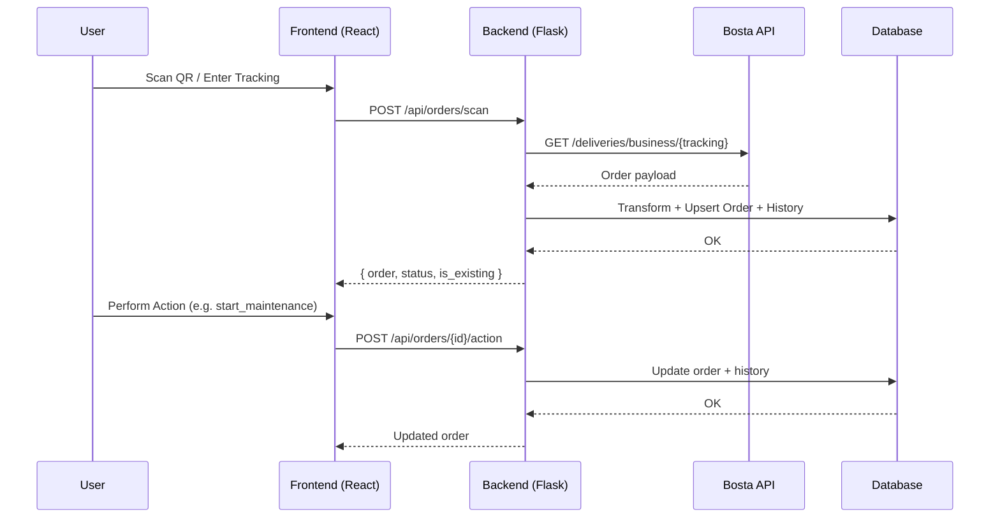
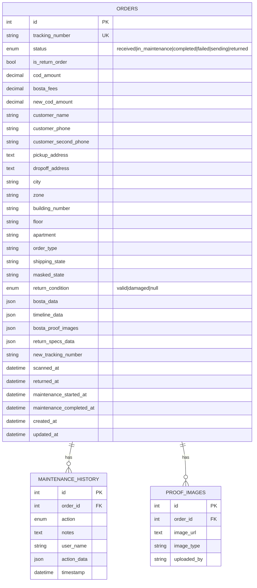

## 🚀 HVAR Hub — Full‑Stack Order Management (Flask + React)

Built for fast, Arabic-first operations with QR scanning, returns handling, and end-to-end order lifecycle. Frontend: React 18 + Vite + Tailwind (RTL). Backend: Flask 3 + SQLAlchemy, with auto DB initialization and Bosta integration.

Badges: React 18 • Flask 3 • Tailwind 3 • PWA • RTL

### 🔄 High‑level Flow



### 🧭 Repo Structure

```
Hvar-Hub/
  back/                 # Flask API
  front/                # React app (Vite)
  run.py                # Dev runner (Windows-friendly)
  passenger_wsgi.py     # Production (Passenger/CyberPanel)
  VPS_DEPLOYMENT_GUIDE.md
```

## ⚙️ Quick Start (Windows/macOS/Linux)

1) Clone

```bash
git clone https://github.com/kariemSeiam/Hvar-Hub.git
cd Hvar-Hub
```

2) Backend

```bash
cd back
python -m venv .venv && source .venv/bin/activate   # PowerShell: .venv\Scripts\Activate.ps1
pip install -r requirements.txt
# Development defaults to SQLite; MySQL used in production if configured
python - <<"PY"
from app import create_app
app = create_app('development')
app.run(host='0.0.0.0', port=5001, debug=True)
PY
```

3) Frontend (new terminal)

```bash
cd front
npm install
npm run dev
# Vite proxies /api → http://localhost:5001
```

Or run both automatically:

```bash
python run.py --dev     # starts Vite + Flask together
```

## 🗃️ Backend (Flask)

### Tech
- Flask, Flask‑CORS, Flask‑SQLAlchemy, Flask‑Migrate
- SQLite in dev with auto‑init; MySQL in production

### Configuration (env)
- FLASK_ENV: development | production | testing
- SECRET_KEY: app secret
- MySQL (production): MYSQL_HOST, MYSQL_PORT, MYSQL_USER, MYSQL_PASSWORD, MYSQL_DATABASE

Notes:
- In development, backend falls back to SQLite automatically.
- On first boot, DB and indexes are auto‑created and schema is self‑healed when safe.
- CORS origins include localhost and `https://mcrm.hvarstore.com` by default.

### Data Models (key fields)

Orders
- tracking_number, status: received | in_maintenance | completed | failed | sending | returned
- customer_name, phones, address, city/zone
- cod_amount, bosta_fees, new_cod_amount
- package_description, weight, items_count
- timestamps: scanned_at, maintenance_started_at, completed_at, returned_at, …
- return_condition: valid | damaged (for returned)
- bosta_data, timeline_data, bosta_proof_images, return_specs_data

MaintenanceHistory
- order_id, action, notes, user_name, action_data, timestamp

ProofImage
- order_id, image_url, image_type, uploaded_by

### Workflow Logic

Actions → Status mapping
- received → received
- start_maintenance → in_maintenance
- complete_maintenance → completed
- fail_maintenance → failed
- reschedule → in_maintenance
- send_order / confirm_send → sending
- return_order / move_to_returns → returned
- refund_or_replace → completed
- set_return_condition → does not change status (only updates return_condition)

Valid transitions are enforced (e.g., you cannot jump to an invalid status).

### API Reference (current)

- Health
  - GET `/api/v1/health`

- Orders
  - POST `/api/orders/scan`
    - body: { tracking_number, user_name?, force_create? }
    - returns: { success, data: { order, is_existing, bosta_data }, message }
  - GET `/api/orders`
    - query: `status?` one of [received, in_maintenance, completed, failed, sending, returned]
    - query: `page?`, `limit?` (max 100), `search?`, `return_condition?` (valid|damaged when status=returned)
    - returns: { success, data: { orders, pagination } }
  - GET `/api/orders/{id}`
  - POST `/api/orders/{id}/action`
    - body: { action, notes?, user_name?, action_data? }
    - returns: { success, data: { order, history_entry }, message }
  - GET `/api/orders/summary`
    - returns: counts per status + total
  - GET `/api/orders/recent-scans?limit=10`
  - POST `/api/orders/refresh/{tracking_number}` (also accepts GET)
  - GET `/api/orders/tracking/{tracking_number}`

Response shape (example)

```json
{
  "success": true,
  "data": { "order": { "id": 1, "tracking_number": "...", "status": "received" } },
  "message": "تم معالجة الطلب بنجاح"
}
```

Security
- Do not hardcode third‑party tokens. Move secrets to server‑side env and never expose them to the browser.

## 🎨 Frontend (React + Vite)

### Tech
- React 18, Vite 6, Tailwind 3, react‑hot‑toast, qr‑scanner
- Arabic RTL UI/UX, PWA manifest, service worker

### Local config
- `front/src/config/environment.js` selects baseURL: dev uses `http://127.0.0.1:5001`, prod uses `window.location.origin`.
- Vite dev proxy forwards `/api` → `http://localhost:5001`.

### Scripts

```bash
npm run dev      # hot reload
npm run build    # production build → front/dist
npm run preview  # preview build
npm run lint
```

### Key UI features
- QR camera scanner with permission checks, debounce, and error handling
- Manual entry and hardware scanner input buffer
- Status tabs: received, in maintenance, completed, failed, sending, returns (sub‑tabs: valid|damaged)
- Order actions trigger backend transitions and update summaries
- Recent scans panel and highlights

PWA
- `front/public/manifest.json` includes Arabic, RTL, icons, and shortcuts.

## 🔐 Environment & Secrets

- Backend env goes in server environment (not committed):
  - FLASK_ENV, SECRET_KEY, MySQL credentials
- Third‑party tokens (e.g., Bosta) must be server‑side only. Exposing tokens in frontend leaks secrets.

## 🛫 Deployment

- Production entry: `passenger_wsgi.py` (CyberPanel/Passenger).
- Build frontend: `cd front && npm run build` (outputs `front/dist`).
- Place `back/` and `front/dist/` under your web root per VPS guide.
- See `VPS_DEPLOYMENT_GUIDE.md` for tested CyberPanel / .htaccess setup, permissions, and checklist.

## 🧩 Dev Tips & Troubleshooting

- Camera requires HTTPS in production; HTTP allowed locally.
- If SQLite file path is relative, it is created under the Flask app root automatically.
- Missing column `orders.return_condition` is auto‑added when safe.
- Windows: if `npm` is not found, `run.py` tries common install paths.
- CORS: allowed origins include local dev and `https://mcrm.hvarstore.com` by default (see `back/app.py`).

## 📈 Roadmap (nice‑to‑have)

- Move third‑party tokens to backend env and proxy all external calls server‑side
- Add authentication/authorization for actions
- Add background jobs for periodic refresh from Bosta
- Add tests and CI

---

Built with ❤️ for high‑speed warehouse operations. PRs welcome.

## 🧑‍💻 Developer Excellence Toolkit

### Commands you’ll use daily

- Run both apps together: `python run.py --dev`
- Backend only (dev, SQLite): `python run.py --server`
- Build frontend for prod: `cd front && npm run build`
- Initialize/repair DB (server-safe): `cd back && python init_db.py`
- Frontend lint: `cd front && npm run lint`

### API quick recipes (copy/paste ready)

```bash
# Health
curl -s http://127.0.0.1:5001/api/v1/health | jq

# Scan (create if not exists via Bosta)
curl -sX POST http://127.0.0.1:5001/api/orders/scan \
  -H 'Content-Type: application/json' \
  -d '{"tracking_number":"TEST123","user_name":"فني الصيانة"}' | jq

# List by status
curl -s 'http://127.0.0.1:5001/api/orders?status=received&page=1&limit=20' | jq

# Search
curl -s 'http://127.0.0.1:5001/api/orders?search=TEST' | jq

# Summary
curl -s http://127.0.0.1:5001/api/orders/summary | jq

# Recent scans
curl -s 'http://127.0.0.1:5001/api/orders/recent-scans?limit=10' | jq

# Order by tracking (fetch if missing)
curl -s 'http://127.0.0.1:5001/api/orders/tracking/TEST123' | jq

# Perform an action (start maintenance)
curl -sX POST http://127.0.0.1:5001/api/orders/1/action \
  -H 'Content-Type: application/json' \
  -d '{"action":"start_maintenance","user_name":"فني الصيانة"}' | jq
```

### Data model (ER diagram)



### Techniques and patterns used (what makes it fast and robust)

- Frontend
  - Lazy-loaded heavy components and Suspense to keep TTI low
  - Debounced QR processing and duplicate-scan suppression
  - Local API/cache layer with TTL (see `front/src/api/orderAPI.js`)
  - RTL-first design and Arabic typography; PWA manifest for installability
  - Vite dev proxy for zero CORS pain in development
- Backend
  - Auto DB initialization and self-healing schema (adds missing columns safely)
  - Defensive serialization with per-order try/catch to avoid list failures
  - Pagination + indexes for predictable performance under load
  - Explicit status machine and action→status mapping, with validation
  - Bosta data transformer normalizes nested structures and Arabic names

### Debugging playbook

- Backend
  - Run in dev with verbose logs: `python run.py --server`
  - Inspect DB via Flask shell:
    ```python
    from app import create_app
    from db import db
    from db.auto_init import Order
    app = create_app('development')
    ctx = app.app_context(); ctx.push()
    db.session.query(Order).count()
    ```
  - If MySQL credentials are wrong in production, app falls back to SQLite in dev; fix env in Passenger.
- Frontend
  - Network tab: all `/api` go to backend; dev proxy is configured in `front/vite.config.js`.
  - Toasts show concise Arabic messages for success/error paths.
  - If camera fails: ensure HTTPS in prod, or grant camera permission locally.

### Quality & collaboration

- Git: prefer small PRs with descriptive titles and checklists
- Commits: use conventional style (feat/fix/refactor/docs/chore)
- Lint: `npm run lint` (React/ESLint 9)
- Migrations (optional): project includes Flask‑Migrate; you can initialize if needed:
  ```bash
  cd back
  flask db init && flask db migrate -m "init" && flask db upgrade
  ```

### Security best practices

- Do not expose third‑party access tokens in the frontend; keep them server‑side in env
- Restrict CORS origins in `back/app.py` for your domains
- Use strong `SECRET_KEY` in production
- Review Passenger `.env` and filesystem permissions per `VPS_DEPLOYMENT_GUIDE.md`

---

Built with ❤️ by [kariemSeiam](https://github.com/kariemSeiam) | [Repository](https://github.com/kariemSeiam/Hvar-Hub) | [Issues](https://github.com/kariemSeiam/Hvar-Hub/issues) | [Pull Requests](https://github.com/kariemSeiam/Hvar-Hub/pulls)